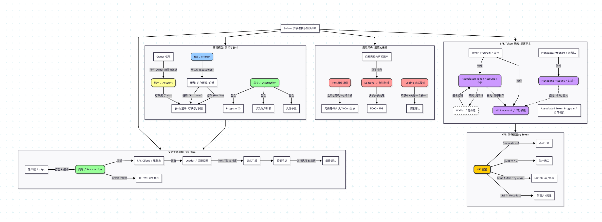

其他区块链基础可以看我的博客北大肖臻老师的课程总结


### 第一部分：官方术语总结（硬核版）

 Solana 如何通过底层的架构创新，解决了以太坊（EVM）的可扩展性瓶颈，实现了 5000+ TPS 的高吞吐量。

**1. 混合共识机制：PoS + PoH (历史证明)**

* **核心机制：** Solana 在权益证明（PoS）的基础上引入了 **历史证明（Proof of History）**。
* **技术原理：** PoH 创建了一个可验证的全局**加密时钟**。它在共识达成之前，就先给所有交易打上精确的时间戳，确立了交易的客观顺序。
* **优势：** 验证节点不需要等待彼此通信来确认时间顺序，从而实现了**并行处理**。这使得 Solana 的出块时间仅为 **400 毫秒**（相比之下以太坊约为 12 秒）。

**2. 独特的虚拟机架构：无状态与并行化**

* **无状态程序 (Stateless Programs)：** Solana 将“程序逻辑”与“状态数据”完全分离。程序本身不存储数据，所有数据存储在独立的**账户（Account）**中。
* **并行执行 (Sealevel Runtime)：** 交易必须在执行前**提前声明**将要读取或修改哪些账户。运行时（Runtime）利用这一特性，将互不冲突的交易（即修改不同账户的交易）分配到不同的 CPU 核心上**并行执行**。
* **优化执行 (SVM vs EVM)：** SVM 基于**寄存器**架构（而非 EVM 的堆栈架构），并直接编译为本地机器码，大大减少了内存移动开销和解释执行的成本。

---

### 第二部分：通俗比喻解释（人话版）

如果把区块链比作一个“繁忙的银行办事大厅”，Solana 和以太坊的区别如下：

**1. 关于“排队”的革命（共识机制 PoH）**

* **以太坊（传统模式）：大家开会**
每处理一批业务，所有柜员必须停下来开个会，互相确认：“刚才那笔转账是 10:01 发生的还是 10:02 发生的？”大家吵完架达成一致了，才能进行下一批。所以特别慢（12秒才出一个块）。
* **Solana（PoH模式）：取号机**
大厅门口放了一台**“绝对精准的取号机”**。你一进门，单子上就印好了时间（历史证明）。
柜员拿到单子一看：“哦，你是 1 号，他是 2 号。” **不需要开会讨论顺序**，直接埋头干活就行。所以特别快（0.4秒出一个块）。

**2. 关于“干活”的革命（虚拟机与并行执行）**

* **以太坊（EVM）：单窗口死磕**
不管办事大厅里有多少人，只开**一个窗口**。
前面的人办业务如果不结束，后面的人哪怕只是想查个余额，也得干等着。这就是“串行执行”，效率极低。
* **Solana（SVM）：百个窗口同时开**
Solana 开了 100 个窗口。
并且它有一个特殊规定：**“进门前先说你要办什么业务”**（提前声明账户）。
大堂经理一看：“小王要改 A 账户的钱，小李要改 B 账户的钱，你俩不冲突。”
**“那你去 1 号窗口，你去 2 号窗口，同时办！”**
只有当两个人都想改 A 账户的钱时，才需要排队。这就是“并行执行”。

**3. 关于“工具”的革命（无状态程序）**

* **以太坊：自动售货机**
代码和数据是锁死在一起的。如果要升级功能或者扩容，就像搬运笨重的自动售货机一样麻烦。
* **Solana：共享厨房**
代码是**厨师**（程序），数据是**食材**（账户）。
厨师站在中间，谁拿着食材来，他都能做菜。一个厨师可以同时服务成千上万个带着不同食材的客户，灵活又高效。
这几张图片（包括测试题、Agenda 议程图、技术优势图、以及核心架构图）共同构成了一份非常完整的 **Solana 开发者入门知识图谱**。

恭喜你拿到了 100 分！为了帮你把这些散落的知识点串起来，我将其整理为 **“官方技术总结”** 和 **“通俗生活比喻”** 两个部分。

---

### 第一部分：技术总结（硬核版）

从宏观优势到微观代码，构建了 Solana 的完整逻辑：

1. **核心架构（为什么快？）**
* **共识机制 (PoH + PoS)**：Solana 引入 **历史证明 (Proof of History)** 作为一个全局加密时钟。节点不需要等待彼此通信来确认时间顺序，交易在共识前就已经排好了队。结果是 **400ms 出块**。
* **并行执行 (Sealevel)**：这是 Solana 的杀手锏。交易必须提前声明“我要读写哪些账户”。系统会安排互不冲突的交易在不同的 CPU 核心上同时跑，实现 **5000+ TPS**。


2. **编程模型（怎么写代码？）**
* **程序与数据分离**：
* **Programs (程序)**：是无状态的（Stateless），只是一堆逻辑代码，不存钱也不存数据。
* **Accounts (账户)**：专门用来存数据（余额、游戏状态）。


* **PDA (程序派生地址)**：没有私钥的账户，完全由程序控制，用于管理资产和跨程序调用。
* **Anchor vs. Pinocchio**：开发工具有权衡。Anchor 是像“脚手架”一样的框架，开发快但代码略大；Pinocchio 是原生开发，难写但性能极致。


3. **资产标准（发什么币？）**
* **SPL Token**：Solana 上的代币标准。
* **Token-2022**：新一代标准，支持将元数据（头像、名字）直接存在链上，还支持转账税等高级功能。


4. **用户体验（结果如何？）**
* **极速确认 (Fast Confirmation)**：亚秒级确认。
* **低手续费 (Low Fees)**：通常低于 $0.001。


---

### 第二部分：通俗易懂的例子（生活版）

为了让你彻底听懂，我们将 Solana 想象成一个 **“超级现代化的大型餐厅厨房”**。

#### 1. 共识机制 (PoH)：从“开会”到“取号机”

* **传统区块链（比特币/以太坊）**：
就像所有的厨师每做完一道菜，都要停下来**开个会**，互相确认：“刚才那盘番茄炒蛋是 12:01 上的，还是 12:02 上的？”大家吵清楚了，才能做下一道菜。这导致上菜很慢（12秒~10分钟）。
* **Solana (PoH)**：
厨房门口放了一台**“精准取号机”**。订单一进来，上面就印死了时间戳：“12:01:001”。厨师拿到单子**不需要开会讨论顺序**，直接按单子做就行。所以上菜极快（400毫秒）。

#### 2. 并行执行：从“单灶台”到“百眼灶”

* **以太坊 (EVM)**：
不管厨房有多大，只开**一个灶台**（单线程）。不管你是要煮满汉全席，还是只要一杯水，所有人都在这一条队伍里排队。
* **Solana (SVM)**：
厨房里有 **100 个灶台**（多核并行）。
关键规则是 **“进门先报菜名”**（提前声明账户）：
* A 客人要炒**白菜**。
* B 客人要炖**牛肉**。
* 大堂经理一看，白菜和牛肉互不影响，**“你俩分别去 1 号灶和 2 号灶，同时开火！”**
* 只有当两个人都想抢**同一块肉**时，才需要排队。


#### 3. 账户模型：从“自动售货机”到“共享厨师”

* **以太坊（智能合约）**：
像一台**自动售货机**。机器（代码）和里面的饮料（数据）是锁死在一起的。如果要升级功能，得重新造一台机器。
* **Solana（程序 + 账户）**：
* **Program (程序)** 是 **厨师**。厨师本人两手空空，不带食材。
* **Account (账户)** 是 **食材篮子**。
* 谁想做菜，就拎着自己的“食材篮子”去找厨师。厨师可以用同一套手艺（代码），服务成千上万个拎着不同篮子（数据）的客人。效率极高，且不用重复雇佣厨师。


#### 4. 开发工具：Anchor vs Pinocchio

* **Pinocchio (原生)**：
就像让你从**种麦子、磨面粉**开始做面包。虽然你可以控制每一个细节，做到极致的口感，但太累了，容易出错。
* **Anchor (框架)**：
就像给你提供了**预制面团和模具**。你只需要把馅料填进去，烤一下就行。虽然可能不如大师手作那么细腻，但**速度快、安全、标准**，适合99%的场景。

### 总结

Solana 之所以能打败旧的公链，是因为它不再像“大家一起记账的小本子”，而更像是一个**拥有精密时钟（PoH）、多核并发（SVM）和流水线分工（账户模型）的超级计算机**。
没问题，这张 **"Technical Advantages"（技术优势）** 的图片非常关键，它直接告诉了我们“用 Solana 有什么好处”。

以下是这张图片的**中文翻译**以及**通俗解释**：


 **Technical Advantages** **技术优势**


* **第一点**: **Fast Confirmation Time**
* **翻译**: **极速的确认时间**
* *含义*: 交易发出去后，网络确认“转账成功”的速度非常快（通常是亚秒级，即不到1秒）。


* **第二点**: **Low Transaction Fees**
* **翻译**: **低廉的交易手续费**
* *含义*: 每笔操作需要付给网络的“Gas 费”极低（通常远低于 0.01 美元）。


* **底部备注**: **(All while maintaining consensus across 1000+ validators)**
* **翻译**: **（在保持全网 1000 多个验证节点达成共识的同时，还能做到以上两点）**
* *含义*: 这句话是在强调“去中心化”。意思是 Solana 并不是通过“偷懒”（比如搞中心化服务器）来变快，而是在有成千上万个节点共同记账的情况下，依然保持了高速和低价。


---

### 2. 通俗易懂的例子（生活版）

为了让你理解这三个点的含金量，我们还是用**“发快递”**或者**“银行转账”**来打比方：

#### A. 关于“极速确认” (Fast Confirmation Time)

* **以太坊（旧模式）**：
就像你去银行柜台汇款，柜员跟你说：“单子收到了，但你需要**在休息区等 15 分钟**，等我们经理盖完所有章，你才能走。”
* **Solana（新模式）**：
就像你用手机支付，**扫码的一瞬间**，“滴”的一声，对方就收到钱了。你不需要在原地等，立马就可以转身走人。

#### B. 关于“低手续费” (Low Transaction Fees)

* **以太坊（旧模式）**：
就像**“跨国加急快递”**。不管你寄的是一张纸还是一块金砖，因为路况拥堵（TPS低），你都要付 **50块甚至100块** 的运费。有时候运费比你买的东西还贵。
* **Solana（新模式）**：
就像**“发电子邮件”**。不管你发多少次，成本几乎可以忽略不计（大概只需要 **0.0001 块钱**）。正因为便宜，你甚至可以在上面玩高频的游戏，而不用心疼钱。

#### C. 关于“1000+ 验证节点” (Consensus across 1000+ validators)

* **中心化服务器（比如 支付宝/微信）**：
快是快，但账本只有**一家公司**在管。如果它服务器宕机或者被黑了，钱就危险了。
* **Solana**：
虽然它像支付宝一样快，但背后其实有 **1000 多个来自世界各地的“公证人”** 在盯着每一笔账。
**厉害之处在于：** 通常我们要让 1000 个人同时签字同意一件事，效率会极低（像开大会一样慢）。但 Solana 用了黑科技（PoH 历史证明），让这 1000 个人能在 **400毫秒** 内瞬间完成签字确认。

### 总结
**既有大银行的安全级别（1000+ 节点），又有扫码支付的体验（极速 + 几乎免费）。**

### solana是如何创建区块和处理交易的整个过程

这张**黑色背景的架构图（图9）**非常核心，它展示了 Solana 区别于其他区块链（如以太坊、比特币）最关键的工作流程：**基于历史证明（PoH）的流式处理机制**。

 Solana 处理交易和创建区块的完整过程。

---

### 第一部分：官方技术原理解析（理论版）

Solana 的区块创建与交易处理可以分为以下四个核心步骤：

1. **领导者接收与排序 (Leader Ingestion & Sequencing)**
* **角色分配**：Solana 网络中没有“竞争挖矿”，而是有一个**“领导者时间表” (Leader Schedule)**。在特定的时间段内（Slot，约400毫秒），全网只有一个指定的验证节点（Validator）担任 **Leader（领导者）**。
* **动作**：所有的用户交易（Transactions，如图左侧所示）都会直接发送给当前的 Leader。
* **PoH 打戳**：Leader 收到交易后，利用 **历史证明 (Proof of History, PoH)** 机制（图右下角的时钟图标），给交易打上一个加密的时间戳。
* **意义**：这在共识达成**之前**就确立了交易的全局顺序，后续验证者不需要通信就可以知道谁先谁后。


2. **流式传输 (Turbine / Streaming)**
* **切片发送**：这是图中间部分展示的重点。Leader **不会**等待整个区块装满才发送。
* **动作**：一旦交易被处理并打上时间戳，Leader 就会将其打包成极小的数据包（Entry/Shreds），像“流水线”一样，**实时、连续地**广播给其他验证者（Validators）。
* **对比**：传统区块链（如比特币）是“打包好一整箱 -> 封箱 -> 发货”。Solana 是“做完一个 -> 发一个 -> 做完一个 -> 发一个”。


3. **验证与并行执行 (Validation & Parallel Execution)**
* **动作**：下游的验证者（图下方的 Validators）收到这些连续的数据流后，立即开始验证 PoH 时间戳的正确性。
* **Sealevel 并行**：同时，验证者利用 Solana 的并行运行时（Sealevel），根据交易声明的账户依赖关系，在多个 CPU 核心上并行执行这些交易（这是你在 Quiz 第6题中学到的点）。


4. **投票与确认 (Voting & Consensus)**
* **动作**：验证者执行无误后，会发出投票（Vote）。
* **状态**：当超过 2/3 的验证者投票确认后，该区块被视为“Confirmed”（已确认），随后进入“Finalized”（最终敲定）状态。


---

### 第二部分：通俗易懂的例子（生活版）

为了解释这个过程，我们把 Solana 网络想象成一个 **“高效率的餐厅后厨”**，而 **Leader** 是今天的 **“主厨”**。

#### 1. 传统区块链（比如比特币/以太坊）：老式大锅饭

* **点单**：客人（用户）把订单（交易）递进窗口。
* **做法**：主厨把订单攒起来，攒够 **100 张**（凑满一个区块）。
* **等待**：主厨开始炒这100盘菜，**所有人都得等**。
* **上菜**：等100盘菜全炒好了，主厨才一次性端出去给服务员（验证者）检查。
* **结果**：非常慢，如果你是第1个点单的，你也得等第100个炒完才能上桌。

#### 2. Solana 模式：流水线回转寿司 + 自动打卡机

**图中的 Leader 就是传送带口的“寿司师傅”。**

* **Step 1: 疯狂点单（Transactions -> Leader）**
客人（用户）把订单像雪花一样扔给寿司师傅（Leader）。
* **Step 2: 自动打卡机（PoH 时钟）**
师傅身边有个**“自动打卡机”**。每做一盘寿司，盘子上立刻印上精确的时间：“12:00:01”、“12:00:02”。
*这就省去了大家以后吵架这一盘是谁先点的麻烦，顺序定死了。*
* **Step 3: 传送带流式发货（Streaming / Turbine）**
**（重点！）** 师傅**绝不**等凑齐 100 盘才发货。
他手里捏好一个寿司，**立刻**就扔到传送带上（发送给 Validators）。
虽然这一餐（区块）还没做完，但前面的盘子已经流出去了。
* **Step 4: 食客实时品尝（Validators）**
坐在传送带下游的食客（验证者）**不需要等整桌菜上齐**。
传送带转过来一盘，他们就吃一盘（验证并执行）。
大家边吃边点头（投票），“嗯，这盘没毒，好吃”。

**总结：**
正是因为 Solana 的 Leader **“不攒单、做完一个发一个”**（流式传输），配合 **“还没发货就已经打好时间戳”**（PoH），才实现了你那张“Technical Advantages”图里说的 **Fast Confirmation Time（极速确认）**。

这张图片（标题 **Accounts**）解释了 Solana 架构中最基础但也最重要的概念：**账户模型（Account Model）**。

这是 Solana 和以太坊最大的区别之一。为了让你彻底理解，我还是按照**“技术要点解析”**和**“通俗生活比喻”**两部分来讲。

---

### 第一部分：技术解析
**“Everything is an account!（一切皆账户）”**

在 Solana 上，无论是你的钱包、智能合约（程序）、还是代币的数据，本质上都是一个“账户”。图片列出了账户的 6 个关键特性：

1. **Unique 256-bit address（唯一的 256 位地址）**
* 每个账户都有一个身份证号，也就是我们常说的“公钥”或“钱包地址”（比如 `8e9...` 这种字符串）。


2. **Hold some balance of SOL（持有 SOL 余额）**
* 账户里必须有钱（SOL）。哪怕这个账户是用来存数据的，它也需要一点点 SOL 来支付“租金”。


3. **Can store arbitrary data（可以存储任意数据）**
* 这是关键！账户不仅仅记“我有多少钱”，还可以记“我是谁、我有多少积分、游戏等级是多少”。
* **注意：** 在 Solana 里，**程序（代码）也是存储在账户里的数据**，被标记为“可执行”。


4. **Data storage is paid with Rent（数据存储需要付“租金”）**
* 区块链上的空间是很贵的。你想在链上存数据，就得付钱给验证节点。
* *注：现在的 Solana 通常采用“租金豁免”机制，只要你在账户里存够一定数量的 SOL（比如 0.002 SOL），就永远不用付租金了。*


5. **权限规则（这是安全的核心）：**
* **Anyone can credit SOL or read data（任何人都可以打钱或读取数据）**：
* 公链是公开透明的。任何人都可以往你的账户转账，任何人都可以查你的账户里有什么数据。


* **Only the account's owner can debit SOL or modify data（只有账户的所有者才能扣款或修改数据）**：
* 这是铁律。只有拥有私钥的人（或者拥有该数据账户的**程序**），才有权把钱转走，或者修改里面的数据。


---

### 第二部分：通俗易懂的例子（透明保险箱）

为了理解 Solana 的账户模型，我们可以把 Solana 区块链想象成一面巨大的**“全透明银行保险柜墙”**。

#### 1. 一切皆账户 = 一切皆箱子

在 Solana 银行里，不管是“用户”、“存折”还是“银行办事员（程序）”，每个人都对应墙上的**一个箱子**。

#### 2. 这里的箱子有什么特点？（对应图片的 6 点）

* **唯一的地址**：每个箱子上都刻着编号（比如 `Box-888`）。
* **必须有押金 (Balance & Rent)**：
你要占用这个箱子，就必须在箱底压一块金条（SOL）。如果你把金条拿走，银行就会把你的箱子回收（账户被清理）。这块金条就是**“租金”**。
* **里面能存东西 (Data)**：
* 如果是**普通用户的箱子**，里面可能只放了一张纸条：“余额：100 SOL”。
* 如果是**游戏账户的箱子**，里面放的纸条写着：“等级：Lv.50，装备：屠龙刀”。
* 如果是**程序的箱子**，里面放的是**一本操作手册（代码）**。


#### 3. 谁能动箱子里的东西？（权限规则）

* **读数据（Read）= 透明玻璃**
所有的箱子都是**透明玻璃**做的。任何路人走过，都能看到你箱子里有多少钱，游戏多少级。
* **打钱（Credit）= 投信口**
箱子有一个单向的**投信口**。任何人（比如张三、李四）都可以往你的箱子里塞钱。这不需要你的钥匙。
* **取钱/改数据（Debit/Modify）= 只有你有钥匙**
如果你想**打开箱子**把钱拿出来，或者想**用笔修改**纸条上的内容（比如把游戏等级从 50 改成 51），**必须插入钥匙（私钥/Owner 权限）**。除此之外，天王老子来了也打不开。

### 总结
在 Solana 开发中，当你听到“创建账户”时，不要只想到“创建钱包”。
**你在创建一个存储单元（箱子）。**

* 你要往里面存 SOL（交租金）。
* 你要定义里面存什么数据（Data）。
* 你要定义谁有钥匙能修改它（Owner）。
###  钱包数据结构

这张图片（`image_407cb6.png`）展示了 Solana 账户在代码层面（类似于 TypeScript 或 Rust 结构体）的具体数据结构。

结合上一张“账户即箱子”的概念，我们可以把这个结构体看作是**贴在箱子侧面的“属性说明书”**。以下是每个字段的详细解释：

### 1. `lamports: number` （余额）

* **定义**：这是账户里持有的 SOL 数量。
* **单位**：**Lamport** 是 SOL 的最小单位（为了致敬计算机科学家 Leslie Lamport）。
* `1 SOL = 1,000,000,000 Lamports` (10 亿)。


* **通俗理解**：箱子底部的**“押金”**。
* 这个字段不仅代表你有多少钱，还决定了你的账户是否会被网络删除（如果余额少于“租金豁免”标准，账户可能会被清理）。


### 2. `data: Uint8Array` （数据存储区）

* **定义**：这是一个**字节数组**（Byte Array），是账户真正用来“存东西”的地方。
* **特点**：它是**“原生的”**（Raw）。Solana 链本身不关心你这里面存的是字符串、数字还是图片数据，它只知道这里有一堆 `0` 和 `1`。
* **通俗理解**：箱子里的**“白纸”**。
* **普通代币账户**：这张纸上写着二进制数据，翻译过来可能是“余额：100 USDC”。
* **NFT 账户**：这张纸上写着“我是编号 #888 的猴子，图片地址是...”。
* **程序账户**：这张纸上写的是**编译好的机器码**（即智能合约的代码逻辑）。


### 3. `is_executable: boolean` （是否可执行）

* **定义**：一个布尔值（True/False）。
* **作用**：它告诉 Solana 运行时（Runtime），这个账户里的 `data` 是一堆普通数据，还是可以运行的代码。
* **True** = 这是一个 **程序（Program / Smart Contract）**。
* **False** = 这是一个 **数据账户（Data Account）**（比如存钱的、存游戏状态的）。


* **通俗理解**：箱子上的**“机器人标签”**。
* 如果贴了标签（True），这个箱子就是一个“厨师”（代码），可以干活。
* 如果没贴标签（False），这个箱子就是一个“菜篮子”（数据），只能被别人读写。


### 4. `owner: PublicKey` （所有者）

* **定义**：指明了**哪个程序**有权修改这个账户的数据。
* **重要规则**：
* 在 Solana 上，**账户通常不属于“用户”（User）**，而是属于**“程序”（Program）**。
* 例如：你的“USDC 代币账户”，它的 Owner 是 **Token Program**（代币程序）。虽然你是这个账户的“管理者”（你可以决定转账），但真正能在底层修改余额数据的，只有 Token Program。


* **通俗理解**：箱子的**“专属钥匙孔”**。
* 上面刻着一把锁，写着：“只有 **Token Program** 的钥匙能打开我修改数据。”


### 总结：一个 Solana 账户的“自画像”

如果把这个结构体翻译成人话，它在说：

> “你好，我是 **[Key/地址]**。
> 我肚子里有 **[lamports]** 这么多钱。
> 我属于 **[owner]** 管辖。
> 我里面存了 **[data]** 这些信息。
> 对了，我 **[is_executable]** 一个会动的机器人（或者：我只是一个静态的档案柜）。”
###  programs

（标题 **Programs**）专门讲解了 Solana 上的 **智能合约（Smart Contracts）**。

在 Solana 的术语里，我们不叫它“智能合约”，而叫 **“程序（Programs）”**。

这不仅仅是换个名字，因为它们的设计逻辑和以太坊完全不同。结合你提供的其他图片（如账户结构图），我为你总结了关于“Solana 程序”的核心知识点。

---

### 第一部分：图片内容的技术解析（硬核版）

根据图片 `image_406d36.jpg` 和 `image_407cb6.png`，Solana 程序具有以下关键特征：

1. **本质是特殊的账户 (Special kind of account)**
* 还记得上一张图说“一切皆账户”吗？程序也是一个账户。
* 区别在于：程序的账户里，`is_executable` 字段被标记为 `true`（可执行）。
* 账户的 `data` 部分存的不是余额或游戏数据，而是 **eBPF 字节码**（也就是编译后的机器代码）。


2. **无状态 (Stateless)** —— **这是核心考点！**
* Solana 的程序是**无状态**的。
* 这意味着：程序内部**不存储**任何用户的状态数据（比如谁有多少钱、投票结果是什么）。
* 程序的作用只是“逻辑处理”。它从外部读取数据账户（Account），修改它，然后写回去。


3. **高性能并行 (Executed in Parallel)**
* 正因为程序自己不存数据（无状态），所以同一个程序可以同时被成千上万个交易调用，只要这些交易处理的是不同的数据账户，就可以在不同的 CPU 核心上并行运行。


4. **权限控制 (Owner)**
* 图片提到：“Must be the owner of an account to modify”（必须是账户的所有者才能修改）。
* **程序**通常是**数据账户**的 Owner。比如，“Token Program”是“你的代币账户”的 Owner，所以只有 Token Program 有权修改你的余额。


5. **可组合性 (Instructions)**
* 程序处理的是“指令（Instructions）”。
* 程序还可以发送指令给**其他程序**（CPI, Cross-Program Invocation）。这就实现了乐高积木般的组合（比如 DeFi 协议调用 Token 程序去转账）。


---

### 第二部分：通俗易懂的例子（共享大厨）

为了理解 Solana 的“无状态程序”，我们继续沿用之前的**厨房比喻**，但这次我们聚焦在**厨师（程序）**身上。

#### 1. 以太坊模式：不仅是厨师，还是仓库管理员

在以太坊（旧模式）里，智能合约就像一个**自带大背包的厨师**。

* 他把所有人的食材（数据）都背在自己身上。
* 张三要炒蛋，厨师从自己包里掏出鸡蛋。
* 李四要炒蛋，厨师也得从自己包里掏。
* **缺点：** 因为资源都锁在厨师身上，一次只能服务一个人（串行），而且背包越来越重，想并行工作很难。

#### 2. Solana 模式：两手空空的特级大厨

在 Solana 里，**程序（Program）** 就是一个**两手空空、只带脑子（逻辑）的特级大厨**。

* **无状态 (Stateless)**：
厨师本人**不带任何食材**。他只记得菜谱（代码逻辑）：比如“如何把蛋炒熟”、“如何切肉”。
* **数据分离 (Data is in other accounts)**：
食材都在**顾客（用户）手里的篮子（数据账户）**里。
* 张三端着自己的篮子（张三的数据账户）来找厨师。
* 李四端着自己的篮子（李四的数据账户）来找厨师。


* **并行执行 (Parallel Execution)**：
因为厨师不需要争抢食材，他可以分身（或者说雇佣 100 个一模一样的分身），同时在 100 个灶台上炒菜。
只要张三和李四的篮子不一样，他们就可以同时开炒，互不干扰。
* **Owner 权限**：
虽然篮子是张三端来的，但为了防止张三偷偷改数据（比如把 1 个蛋改成 100 个），Solana 规定：**只有厨师（程序）有权动篮子里的东西。** 张三只能把篮子递进去，怎么改由厨师说了算。

### 总结

核心就是告诉你：
Solana 的程序不存数据，只存逻辑（菜谱）。数据都在独立的账户（篮子）里。
这种**“菜谱与食材分离”**的设计，就是 Solana 能够快到飞起的根本原因。

### program instructions

这张图片（标题 **Instructions**）展示了 Solana 交易中最小的执行单位——**“指令（Instruction）”**的数据结构。

如果说“交易（Transaction）”是一个大的包裹，那么“指令”就是包裹里的一张张**具体的任务单**。一笔交易可以包含多条指令。

结合图片中的代码结构，我为你详细拆解它的三个核心组成部分：

---

### 第一部分：图片内容的技术解析

从图片 `image_34a2b4.png` 的结构体中，我们可以看到一条指令必须包含以下三个要素：

1. **`program_id` （找谁办？）**
* **定义**：目标程序的 ID（地址）。
* **作用**：它告诉 Solana 网络：“这条指令是发给哪个程序去执行的？”
* *例如：是发给“Token 程序”去转账？还是发给“System 程序”去创建账户？*


2. **`keys` （用到哪些账户？）**
* **定义**：一个包含账户元数据的数组。这里列出了这条指令执行时需要用到的所有账户。
* **核心属性**：
* `key`: 账户的地址。
* `is_mutable` (是否可变)：**关键点！** 如果设为 `true`，表示程序执行完后，这个账户里的数据（如余额）会发生变化。如果设为 `false`，程序只能读取，不能修改。
* `is_signer` (是否签名)：**权限核心！** 如果设为 `true`，表示这个账户的拥有者（Owner）已经用私钥签了名，同意进行这次操作（比如同意把自己的钱转走）。


3. **`data` （具体办什么事？）**
* **定义**：字节数组 (`Uint8Array`)。
* **作用**：这是传递给程序的具体参数。
* *例如：如果这是一条“转账”指令，这个 data 里就编码了“转多少钱”、“转什么币”等具体数值。*


---

### 第二部分：通俗易懂的例子（餐厅点单）

为了让你秒懂，我们继续回到**“Solana 大餐厅”**的场景。

想象你（用户）发了一笔交易，里面有一条**指令**，内容是**“我要给朋友买单”**。这条指令（Instruction）就像是一张**“严谨的传菜单”**：

#### 1. `program_id` = 指定厨师

单子上第一行写着：**“交给：Token 大厨（转账程序）”**。

* *系统知道：哦，这事儿不归做卫生的管，也不归管安保的管，得找管钱的 Token 大厨。*

#### 2. `keys` = 涉及的食材篮子

单子上列出了这次操作涉及的所有篮子（账户），并且标明了规矩：

* **篮子 A（你的钱包账户）**：
* `key`: 你的地址。
* `is_mutable: true`：**（要改）** 因为钱要变少了，厨师需要修改里面的数字。
* `is_signer: true`：**（已签字）** 这很重要！就像你在单子上签了字，证明是你自愿买单的。如果没有签字，厨师绝对不敢动这个篮子。


* **篮子 B（朋友的钱包账户）**：
* `key`: 朋友的地址。
* `is_mutable: true`：**（要改）** 因为钱要变多了，厨师也要修改它。
* `is_signer: false`：**（没签字）** 收钱不需要朋友签字，只要你知道他地址就行。


#### 3. `data` = 具体的做菜要求

单子最后一行写着一串密码（Data）：

* 翻译过来就是：**“转账 50 个 SOL”**。

### 总结

这张图告诉你，Solana 的程序（厨师）非常“死板”。他接到任何指令时，只会看这三件事：

1. **是不是叫我？** (`program_id`)
2. **要动哪些人的篮子？谁同意了？谁的数据要改？** (`keys`: `is_signer`, `is_mutable`)
3. **具体怎么动？** (`data`)

这就解释了为什么 Solana 能并行执行：系统只要看一眼 `keys` 里的 `is_mutable`，就知道这条指令会不会和别人的指令冲突了。

这张图片（标题 **Transactions**）展示了 Solana 网络中数据传输的“大包裹”——**交易（Transaction）** 的结构。

如果说“指令（Instruction）”是具体要做的任务，那么“交易”就是把这些任务打包好、贴上邮票、签好字，最终发给区块链网络的那个**信封**。

---

### 第一部分：图片内容的技术解析

从图片 `image_3444bf.png` 的代码结构中，我们可以看到一个交易主要由两部分组成：`message`（消息体）和 `signers`（签名列表）。

#### 1. `instructions: Array<Instruction>` （任务清单）

* **定义**：这是一个指令的**数组**。
* **关键点**：一笔交易可以包含**多条指令**。
* **原子性 (Atomicity)**：这是区块链最重要的特性之一。这组指令要么**全部成功**，要么**全部失败**。
* *例如：指令A是扣你的钱，指令B是给商家加钱。如果指令B失败了，指令A也会自动回滚，你的钱不会白扣。*


#### 2. `recent_blockhash: number` （防伪时间戳）

* **定义**：这是网络中最近的一个区块的哈希值。
* **作用**：它起到了 **“有效期”** 和 **“防重放”** 的作用。
* Solana 的交易是有寿命的（大约 1 分钟）。如果这个 `recent_blockhash` 太旧了，验证节点就会直接丢弃这笔交易。
* 这防止了你在 2023 年发的一笔交易，被黑客截获后，在 2025 年又重发一遍来扣你的钱。


#### 3. `fee_payer: PublicKey` （谁买单？）

* **定义**：支付这笔交易手续费（Gas Fee）的账户地址。
* **灵活性**：**买单的人不一定是发起交易的人！**
* 你可以发起一笔转账，但是由你的朋友（或者应用方的服务器）来填这个 `fee_payer`。这就是 Solana 上“免气费交易（Gasless Transaction）”的实现原理。


#### 4. `signers: Array<Uint8Array>` （签字画押）

* **定义**：这里存放的是真正的**加密签名**数据。
* **规则**：交易里包含的所有指令中，任何被标记为 `is_signer: true` 的账户，都必须在这里留下签名。只要少一个签名，整笔交易就会无效。

---

### 第二部分：通俗易懂的例子（餐厅套餐）

我们继续用餐厅的比喻。如果“指令”是“炒一盘蛋”，那么**“交易（Transaction）”就是一张完整的【点菜订单】**。

#### 1. 数组结构 (`instructions`) = 套餐组合

你递给服务员一张单子，上面写着：

* **任务 1**：把张三的一盘红烧肉端给李四（转账）。
* **任务 2**：给李四倒一杯水（交互）。
* **任务 3**：记录这次服务态度（写数据）。

这三个任务打包在这一张单子里。**如果倒水的时候杯子碎了（任务2失败），那么红烧肉也不许端，服务态度也不许记，一切回到进门前的状态（原子性回滚）。**

#### 2. 最近区块哈希 (`recent_blockhash`) = 当日有效章

单子上盖了一个章：**“仅限 2026年2月1日 12:00 前有效”**。
如果你拿着上个月的单子想来再吃一顿霸王餐，服务员看一眼日期（Blockhash）过期了，直接把单子扔进垃圾桶。

#### 3. 费率支付者 (`fee_payer`) = 请客的大佬

虽然菜是张三点的，也是端给李四的，但单子上写着：**“王五买单”**。
只要王五愿意签字付服务费，餐厅就不管是谁吃的。

#### 4. 签名列表 (`signers`) = 确认签字

这张单子涉及了要把张三的红烧肉端走，还要王五付钱。
所以，单子底部必须有：

* **张三的签名**（同意肉被端走）。
* **王五的签名**（同意付钱）。
如果只有张三签了，王五没签，服务员是绝对不会接单的。

### 总结

交易就是 Solana 里的**原子包裹**。它利用 `instructions` 组合逻辑，利用 `recent_blockhash` 保证时效，利用 `fee_payer` 灵活付费，利用 `signers` 确保安全。
### 交易生命周期

这张图片（`image_342ef2.png` 和 `image_342e93.jpg`）是整个知识体系的**“大结局”**。它把你前面学的账户、程序、指令、交易全部串联起来，演示了一个真实的 Solana 应用是如何跑通全流程的。

* RPC 的全称是 Remote Procedure Call。

中文通常翻译为：远程过程调用。
我们设定的场景是：**一个简单的计数器应用（Counter Program）**。

* **目标**：把链上记录的一个数字（Count）从 0 变成 1。

下面我结合之前的**所有知识点**，为你讲述这笔交易的“奇幻漂流记”。

---

### 第一阶段：打包发货（客户端 Client）

**1. 用户发起动作 (User Action)**

* **场景**：用户在网页（dApp）上点击了一个按钮：“计数 +1”。
* **技术细节**：客户端（Client）开始组装一个**交易（Transaction）**包裹。
* 它往包裹里塞进了一条**指令（Instruction）**：
* `program_id`: 指向“计数器程序”（告诉网络去找哪个厨师）。
* `keys`: 列出“计数器账户”（Counter Account），并标记为 `is_mutable: true`（告诉厨师要改这个篮子里的数）。
* `data`: 具体的命令“Increment”（+1）。


**2. 签名与发送 (Sign & Send)**

* **场景**：钱包弹出窗口，用户点击“确认”。
* **技术细节**：用户用私钥对交易进行签名（Signers），然后客户端把这个签好字的包裹发送给 **RPC Client**。

---

### 第二阶段：传输与路由（RPC & Validator）

**3. RPC 转发 (Routing)**

* **角色**：RPC Client 就像餐厅的**服务员**。
* **动作**：它收到用户的包裹，看了一眼要去哪里，然后把它转发给当前负责记账的 **Validator（验证节点/Leader）**。

**4. 验证节点接收 (Leader)**

* **角色**：Leader 就像**后厨经理**。
* **动作**：
* 他收到交易，先看有没有签名（验签）。
* 然后用 PoH 时钟给交易打上时间戳（排号）。
* 如果是海量交易，他会利用**并行执行**机制，把你这笔交易分配给空闲的 CPU 核心去处理。


---

### 第三阶段：执行逻辑（Program & Account）—— **最核心部分！**

这就是 `image_342e93.jpg` 右半部分展示的内容，也是 Solana 架构的精髓。

**5. 召唤程序 (Program Execution)**

* **对应图片**：紫色的 `Program` 方块。
* **动作**：
* Validator 根据交易里的 `program_id`，把沉睡的**“计数器程序”**（无状态的逻辑代码）唤醒。
* **比喻**：厨师（程序）走到了灶台前，但他手里是空的。


**6. 读取账户 (Account Loading)**

* **对应图片**：白色的 `Counter Account` 方块。
* **动作**：
* Validator 把用户指定的**“计数器账户”**（存数据的篮子）递给程序。
* 此时，账户里的数据是 `count = 0`。


**7. 修改状态 (State Modification)**

* **动作**：
* 程序（Program）读取篮子里的数据（0）。
* 程序执行指令逻辑（+1）。
* 程序把新的数据（1）写回篮子（Counter Account）。


* **关键点**：**程序本身没有变（它是无状态的），变的是账户里的数据。**

---

### 第四阶段：确认与落账（Finality）

**8. 全网同步**

* Leader 把处理完的结果（“那个篮子里的数变成 1 了”）打包进区块，通过流式传输（Turbine）广播给全网其他验证者。

**9. 最终确认**

* 其他验证者验证无误后投票。一旦票数超过 2/3，这笔交易就在链上永久生效了。用户的网页上显示：“当前计数：1”。

---

### 通俗版总结：餐厅改菜单

为了让你彻底记住这个流程，我们用**“修改餐厅门口小黑板上的今日特价”**来打比方：

1. **用户（Client）**：你是餐厅老板，你想把“特价菜”的数量从 0 改成 1。你写了一张纸条（**交易**），上面写着“把黑板上的数+1”，并盖了你的私章（**签名**）。
2. **服务员（RPC）**：你把纸条交给服务员，服务员跑去后厨交给经理。
3. **经理（Validator）**：经理确认是老板的章，然后安排干活。
4. **厨师（Program）**：经理叫来一个**识字的厨师**（程序）。注意，厨师脑子里只有“怎么写字”的知识，手里没有黑板。
5. **黑板（Account）**：经理指了指门口那块**特定的黑板**（计数器账户）。
6. **执行**：厨师走过去，擦掉原来的 `0`，写上 `1`。
7. **结果**：厨师拍拍手走了（无状态），但黑板上的字永远变了（状态改变）。

这就是 Solana 交易的完整生命周期！
**RPC Client (远程过程调用客户端)** 是连接你的应用程序（dApp）和区块链网络（Solana 集群）之间的**“桥梁”**或**“翻译官”**。

简单来说，你的网页或手机 App 本身是无法直接和区块链说话的，它需要通过 RPC Client 来传话。

为了让你延续之前的理解，我们继续使用**“餐厅”**的比喻，同时结合技术视角来解释。

---

### 1. 通俗比喻：它是餐厅里的“服务员”

* **你是顾客（dApp / 前端页面）**：
你坐在餐桌旁，你想点菜（发送交易）或者想问问今天有什么特价菜（查询余额）。但你不能直接冲进后厨去拍大厨（Validator / 验证节点）的肩膀，因为大厨正在忙着炒菜（打包区块），没空理你。
* **RPC Client 是服务员**：
你需要把你的需求告诉服务员。
* **查询（读）**：你问服务员：“我的余额还有多少？”服务员跑去柜台查一下，回来告诉你：“还有 50 SOL”。
* **交易（写）**：你把写好的点单纸（签好名的交易）交给服务员。服务员把它送到后厨交给经理（Leader），如果后厨接单了，服务员会跑回来告诉你：“下单成功！”


---

### 2. 技术视角：它具体做什么？

在 Solana 开发中（比如使用 JavaScript/TypeScript），RPC Client 通常指的就是 `solana-web3.js` 库里的 `Connection` 对象。

它主要负责三件事：

#### A. 建立连接 (Connection)

它知道区块链入口在哪里。你需要给它一个 **RPC Endpoint（节点地址）**，比如：

* 主网地址：`https://api.mainnet-beta.solana.com`
* 开发网地址：`https://api.devnet.solana.com`

#### B. 数据查询 (Read)

它把你的代码指令翻译成区块链能听懂的 JSON-RPC 格式，去链上拉取数据。

* **你写代码**：`connection.getBalance(walletAddress)`
* **RPC Client 做事**：向节点发送一个 HTTP 请求，问“查查这个地址有多少钱”，然后把返回的 JSON 数据解析成数字给你。

#### C. 广播交易 (Write)

当你发起转账或调用合约时，RPC Client 负责把那个**签好名的“二进制大包裹”（Transaction）** 发送给网络中的验证节点。

* **你写代码**：`connection.sendTransaction(transaction)`
* **RPC Client 做事**：把包裹扔进 Solana 网络的数据流里（Turbine），并监听结果，告诉你这笔交易是成功了还是失败了。

### 3. 为什么需要它？

如果没有 RPC Client，作为开发者的你就需要：

1. 自己去学怎么建立 TCP/WebSocket 连接。
2. 自己手动拼写复杂的 JSON 字符串。
3. 自己处理网络重试和错误解析。

**RPC Client 把这些脏活累活都封装好了**，你只需要调用简单的函数（如 `getAccountInfo`），就能像操作本地数据库一样操作区块链。

### 总结

在之前的生命周期图 中：

* **User** 是发起人。
* **Client (dApp)** 是你的程序界面。
* **RPC Client** 就是那个负责把 Client 里的交易**“路由 (Route)”** 发送给 **Validator** 的传输管道。


这张**全黑背景的架构图（图13）**与上一张文字图（图12）是完美的配套。文字图告诉你“有哪些角色”，而这张架构图告诉你“这些角色是如何连接和协作的”。

结合这两张图，我们可以把 Solana 的代币系统看作是一个**精密的“乐高积木”系统**。

---

### 第一部分：图解 Solana 代币系统的“铁三角”

从图中可以看到，一个完整的代币（比如 USDC 或某个 NFT）实际上是由**三个独立的账户**通过链式引用（箭头）拼凑而成的。

#### 1. 绿色部分：铸币厂 (Mint)

* **对应程序**：`Token Program` (左上圆柱)
* **对应账户**：`Mint Account` (中间绿色方块)
* **核心作用**：**定义“这是什么钱”**。
* 这个账户里只记录冷冰冰的数学参数：**总供应量**（比如 1亿个）、**精度**（比如 6位小数）、**铸币权限**（谁能印钱）。
* 它**不知道**这钱叫“USDC”，也不知道这钱长什么样。


#### 2. 紫色部分：门面担当 (Metadata)

* **对应程序**：`Metadata Program` (右上圆柱)
* **对应账户**：`Metadata Account` (中间紫色方块)
* **核心作用**：**定义“这钱长什么样”**。
* 注意中间那条虚线箭头：`Metadata` 指向 `Mint`。这说明它是挂在 Mint 账户上的“说明书”。
* 这里面存着：**名称** (Name)、**符号** (Symbol, 如 "$SOL")、**图片链接** (URI, 显示 Logo 或 NFT 图片)。
* 如果没有它，你的代币在钱包里就只是一串乱码地址。


#### 3. 蓝色部分：私人金库 (Associated Token Account / ATA)

* **对应程序**：`Associated Token Program` (左下圆柱)
* **对应账户**：`Associated Token Account` (中间蓝色方块)
* **核心作用**：**定义“谁拥有多少钱”**。
* 这是最复杂也是最精妙的部分。请看它身上的两条虚线：
1. **连向 Mint**：表示“我存的是哪种币”（是 USDC 还是 USDT？）。
2. **连向 Wallet**：表示“我是属于谁的”（是张三的还是李四的？）。


* **Balance**：它里面记录了你具体的余额。


---

### 第二部分：通俗易懂的例子（升级版：现代化银行体系）

为了彻底看懂这张图的**箭头关系**，我们把发币和转账比作**“开设一家现代化银行”**。

#### 1. 绿色 Mint = “印钞母版”

* 央行（Token Program）制造了一个**“美元印钞板”**（Mint Account）。
* 板子上刻着规则：总共印 1 万亿张，最小单位是 1 分钱。
* *此时，这张钞票还是白纸，没有图案。*

#### 2. 紫色 Metadata = “防伪设计图”

* 设计部（Metadata Program）画了一张**“美元设计图”**（Metadata Account）。
* 设计图上画了本杰明·富兰克林的头像，写着“United States Dollar”。
* 设计部把这张图**贴在**印钞板旁边（虚线连接），告诉大家：“用这个板子印出来的钱，就长这个样子。”

#### 3. 白色 Wallet = “你的身份证”

* 图右下角的 **Wallet** 只是你的**身份证**（私钥/公钥）。
* **关键点**：身份证本身是**不能存钱**的！你不能把钞票塞进身份证的卡套里。

#### 4. 蓝色 ATA = “你的专属保险柜”

* 你要存钱，必须去银行（Associated Token Program）。
* 银行柜员看了一眼你的**身份证**（Wallet），又看了一眼你想存**哪种钱**（Mint）。
* 柜员经过计算，指着墙上**唯一的一个柜子**说：“按规定，**只有这个柜子**（ATA）能属于你。”
* 于是，你在柜子里存了 100 块。
* 柜子门上贴着标签：**“属于 [你的身份证号] 的 [美元] 柜子”**。


### 总结图中的“关系网”

这张图最核心的逻辑是 **“分离与引用”**：

* **Mint** 管“**种类**”。
* **Metadata** 管“**长相**”。
* **ATA** 管“**余额**”。
* **Wallet** 只是“**钥匙**”。

当你打开 Phantom 钱包看到“我有 100 USDC”时，钱包其实是在后台：

1. 先找到你的 **Wallet**。
2. 通过算法找到你的 **ATA**（读出余额 100）。
3. 通过 ATA 找到 **Mint**。
4. 通过 Mint 找到 **Metadata**（读出名字 "USDC" 和图标）。
5. 最后把这些拼起来展示给你看。

**“如何在一次操作中，从零开始发行一种全新的代币，并把第一笔钱发给自己”。**

这张图片（标题 **Instructions**）非常棒，它不仅复习了之前所有的概念（Account, Mint, ATA），还引出了 Solana 交易机制中最强大的特性：**原子性组合（Atomic Composability）**。

简单来说，这张图展示了**“如何在一次操作中，从零开始发行一种全新的代币，并把第一笔钱发给自己”。**

我还是分两部分为您解读：

---

### 第一部分：图片内容的技术解析

图片左边列出了 **4 条独立的指令 (Instructions)**，右边用一个大括号把它们包起来，变成了一个 **交易 (Transaction)**。

我们逐行拆解这 4 个步骤，看看它们分别在做什么（对应之前的知识点）：

1. **Create a new account（创建一个新账户）**
* 这是第一步。在 Solana 上做任何事都需要“箱子”。这里我们向系统申请了一个空白的箱子，准备用来做“印钞机”。


2. **Initialize that account as a mint（初始化该账户为 Mint）**
* 调用 **Token Program**，给上面那个空白箱子贴上“印钞机”的标签。
* 此时，定义了代币的精度（小数位）和管理员权限。现在你有了“印钞机”，但还没有印出钱，也没有地方放钱。


3. **Create an associated token account（创建一个关联代币账户 / ATA）**
* 调用 **Associated Token Program**。
* 这一步是为了给自己（或别人）创建一个“钱包账户”，专门用来接收这种新发行的币。


4. **Mint new tokens to that associated token account（铸造新代币到该 ATA）**
* 终于开始印钱了！调用 **Token Program** 的 Mint 指令。
* 指令内容：“印 100 个币，放进第 3 步创建的那个 ATA 账户里。”


#### 最关键的概念：右边的“大括号” (The Bracket)

图中最核心的不是这 4 个步骤本身，而是右边那个**聚合的结构**。
这展示了 Solana 的 **原子性 (Atomicity)**：

* **打包执行**：你不需要发 4 次交易，不需要签 4 次名，也不需要等 4 次确认。你把这 4 张“任务单”塞进**同一个信封（Transaction）**里发出去。
* **同生共死**：这 4 个步骤要么**全部成功**，要么**全部失败**。
* *假设前 3 步都成功了，但第 4 步印钱的时候出错了（比如权限不对）。那么，系统会自动回滚，把第 1、2、3 步全部撤销，就像什么都没发生过一样。*


---

### 第二部分：通俗易懂的例子（宜家购物）

想象你去宜家（IKEA）买家具。

#### 1. 传统区块链模式（非原子性）：

你得排 4 次队，结 4 次账：

* **第一趟**：买一个空柜子架子（Create Account）。结账，搬上车。
* **第二趟**：买柜门的配件（Init Mint）。结账，搬上车。
* **第三趟**：买里面的储物盒（Create ATA）。结账，搬上车。
* **第四趟**：买要放进去的衣服（Mint Tokens）。结账，搬上车。
* *风险：如果你买完柜子发现储物盒卖光了，你手里就剩个没用的空柜子，退货还很麻烦。*

#### 2. Solana 模式（原子性交易）：

这就好比你雇了一个**全能采购员**，你给了他一张清单（Transaction），上面写着 4 件事。
采购员进商场转了一圈。

* **情况 A（成功）**：4 样东西都齐了，他一次性打包运到你家。
* **情况 B（失败）**：他发现“储物盒”缺货了。
* 他**不会**先把柜子运给你。
* 他会直接两手空空地回来告诉你：“任务失败，没货了。”
* **你的钱一分没少，家里也没多出一堆没用的半成品。**


### 总结

解释了为什么 Solana 的开发体验很顺滑。开发者可以把复杂的业务逻辑（比如“建号+初始+发币+空投”）像搭积木一样写在**一个交易**里，既快又安全。


token是如何在solana上运作的？结合图片

这是一个非常好的问题。要理解 Solana 上的代币运作方式，我们需要把最后几张图片的内容串联起来。

简单来说，Solana 上的代币系统不像以太坊那样“每个代币都是一个独立的智能合约”，而更像是一个**“标准化的积木系统”**。

结合图片 `image_33c1bc.png` (程序列表)、`image_33b6f3.png` (架构关系) 和 `image_3202df.png` (创建流程)，我为您详细拆解 Solana 代币的运作机制。

---

### 1. 核心角色：三个“大管家” (Programs)

首先，看图片 `image_33c1bc.png`。Solana 上 99% 的代币（无论是 USDC 还是某个 MEME 币）都不需要自己写代码，而是直接调用链上已有的三个**通用程序**：

1. **Token Program (SPL)**：**“账房先生”**。它负责最底层的数学逻辑，比如定义“这是什么币”、“总共有多少个”、“转账加减余额”。
2. **Associated Token Program (SPL)**：**“账户经理”**。它负责帮用户开设存币的账户。它能确保你的钱包地址和代币类型之间，有一个唯一确定的存币地址。
3. **Metadata Program (Metaplex)**：**“装修公司”**。它负责给代币加上名字、符号（Symbol）和 Logo 图片。没有它，你的币在钱包里就是一串乱码。

---

### 2. 架构关系：四个“积木块” (Accounts)

接下来，看那张最复杂的黑色背景连线图 `image_33b6f3.png`。这张图展示了代币在链上的存储结构。

一个完整的代币系统由以下四个部分组成：

* **Mint Account (绿色块)**：**“印钞模版”**。
* 这是代币的**源头**。
* 它里面只记录：供应量（Supply）、精度（Decimals）和谁有权铸币（Mint Authority）。
* 它**不知道**这个币叫什么名字，也**不存**任何人的余额。


* **Metadata Account (紫色块)**：**“产品说明书”**。
* 它指向 Mint Account。
* 它存储了代币的 **名称 (Name)**、**缩写 (Symbol)** 和 **图片链接 (URI)**。
* 钱包显示代币信息时，读的就是这里的数据。


* **Associated Token Account (ATA) (蓝色块)**：**“你的存折”**。
* **这是最关键的概念！** 你的 **Wallet (白色块)** 不能直接存代币。
* 你必须拥有一个专门的 ATA 账户。
* 这个 ATA 账户同时连接两头：
1. 指向 **Mint**：说明存的是哪种币。
2. 指向 **Wallet**：说明这钱属于谁。


* 你的 **余额 (Balance)** 是存在这里的。


* **Wallet (白色块)**：**“身份证/钥匙”**。
* 它只是你的公钥/私钥对。它用来签署交易，证明你是 ATA 的主人。


---

### 3. 运作流程：从无到有 (Lifecycle)

最后，看图片 `image_3202df.png`。这张流程图展示了如何在 Solana 上发行一个代币并把钱发给自己。

这个过程通常分为 5 步，但可以在一笔交易中完成：

1. **Create Mint Account**：申请一个空白的盒子，作为未来的“印钞模版”。
2. **Initialize Mint**：在盒子上盖章，设定它的小数位（比如 6 位）和铸币权限。
3. **Create Metadata**：给这个模版贴上标签，写上名字（如 "MyCoin"）和上传 Logo。
4. **Create ATA**：为接收者（比如你自己）创建一个专门存这个币的“存折”。
5. **Mint Tokens**：开动印钞机，印出 10 个币，直接塞进第 4 步创建的那个 ATA 存折里。
* *结果：你的 ATA 里的 `balance` 变成了 10。*


### 总结：通俗比喻

* **Mint Account** 是 **央行的印钞版**（只定义面额，不属于任何人）。
* **Metadata Account** 是 **钞票的设计图**（定义钞票长什么样）。
* **Wallet** 是 **你本人**（持有身份证）。
* **ATA** 是 **你在银行开的户头**（专门用来存这种钞票，钱都在这）。
* **Token Program** 是 **银行系统**（负责处理所有的存取转账）。

这就是为什么在 Solana 上，你会发现你的钱包里针对每一种不同的币，都有一个不同的“接收地址”（虽然现代钱包会帮你自动隐藏这个细节，只显示你的主地址）。


这张图片（标题 **NFTs**）揭示了 Solana 上 NFT 的技术本质。

虽然大家都知道 NFT 是“非同质化代币”或“数字藏品”，但这张图告诉你，从**代码层面**看，Solana 上的 NFT 其实并没有什么“特殊魔法”。

**它的核心定义只有一句话：NFT 只是一个配置特殊的 SPL Token。**

我还是分为**技术原理解析**和**通俗比喻**两部分来讲。

---

### 第一部分：图片内容的技术解析

图片列出了 Solana NFT 的 4 个技术特征：

1. **Are SPL Tokens（它们就是 SPL 代币）**
* **含义**：NFT 和 USDC、USDT 在底层技术上是**完全一样**的。它们都由同一个 **Token Program** 管理，都存放在 **ATA 账户**里。
* **优势**：这意味着所有支持 SPL 代币的钱包（Phantom）、交易所和协议，天然就支持 NFT，不需要重新开发一套标准。


2. **Have 0 decimal places（精度为 0）**
* **含义**：我们在铸造 NFT 时，把 Mint Account 的 `decimals` 设置为 `0`。
* **结果**：这意味你不能拥有 `0.5` 个 NFT。你只能拥有 1 个或 0 个。它是**不可分割**的。


3. **Have a total supply of 1（总供应量为 1）**
* **含义**：我们在铸造时，只印出 **1 个** 代币，然后通常会把“印钞机”的开关砸烂（Revoke Mint Authority，虽然图里没写，但这是行业惯例）。
* **结果**：这保证了它的**唯一性**和**稀缺性**。全宇宙只有这 1 个。


4. **Can have highly-customizable metadata（拥有高度可定制的元数据）**
* **含义**：既然只有 1 个，那它得长得不一样才行。
* **作用**：我们利用 **Metadata Program**，在这个代币上绑定复杂的 JSON 数据。这里面定义了它的图片地址（URI）、属性（比如“背景：金色”、“眼睛：激光眼”）。这是 NFT 的**灵魂**。


---

### 第二部分：通俗易懂的例子（印刷厂）

我们继续用之前的“印钞厂”比喻。

#### 1. 普通代币 (Fungible Token, 如 USDC)

* **设置**：
* 印钞机精度：2位小数（可以有 1.50 元）。
* 印钞机总量：10 亿张。
* 元数据：统一写着“这是 1 美元”。


* **结果**：印出来 10 亿张一模一样的纸。你手里的那张和我手里的那张**没有任何区别**，可以随便互换。

#### 2. NFT (Non-Fungible Token, 如无聊猿)

* **设置**：
* 印钞机精度：**0**（不能把画撕成两半卖）。
* 印钞机总量：**1**（只印一张）。
* 元数据：**“这是一只戴墨镜的猴子，编号 #888”**。


* **结果**：印出来一张**独一无二的收藏卡**。
* 因为只印了这一张，所以它很珍贵。
* 因为它是 SPL Token，所以它也能像美元一样，放在你的**银行保险柜（ATA）**里，也能通过**银行转账（Token Program）**发给别人。


### 总结

这张图告诉你：在 Solana 上开发 NFT，其实就是创建一个 **SPL Token**，然后把它的参数设死：**“只能印 1 个，不能切分”**，最后给它贴上一张**漂亮的说明书（Metadata）**。

### Account State for SPL Token

这张图片（标题 **Mint Account**）展示了 Solana 代币系统中最核心的那个“印钞模版”的内部数据结构。

无论你是发一个像 USDC 这样的同质化代币，还是发一个像“无聊猿”这样的 NFT，链上的 Mint Account 存储的都是**完全一样**的这个结构体。

我将分两部分为您解读：首先解释这个结构体中每个字段的通用含义，然后解释**当它作为一个 NFT 时，这些字段会被设置成什么样**。

---

### 第一部分：通用结构解析 (The Anatomy of a Mint)

图片 `image_31ec61.png` 展示的代码结构体定义了代币的“物理属性”：

1. **`is_initialized: boolean` （是否已初始化）**
* **含义**：这就好比印钞机的一个“电源灯”。
* **作用**：防止重复初始化。一旦变成 `true`，就表示这个账户已经正式成为一个 Mint，参数定死了，不能再被重置为另一种币。


2. **`supply: number` （当前供应量）**
* **含义**：当前市面上**一共**有多少个这种币在流通。
* **动态变化**：每次你调用 Mint 指令，这个数字会增加；每次调用 Burn（销毁）指令，这个数字会减少。
* *例如：如果 USDC 增发了 100 万，这个字段就会自动 +1,000,000。*


3. **`decimals: number` （精度/小数位）**
* **含义**：决定了这个代币最小能切分到多少。图片右边的注释写着 `quantity * 10 ^ (-1 * d)`，这是前端显示的数学公式。
* **例子**：
* **SOL** 的 decimals 是 `9`。所以在链上存 `1,000,000,000` (Lamports)，前端显示为 `1 SOL`。
* **USDC** 的 decimals 是 `6`。链上存 `1,000,000`，前端显示为 `1 USDC`。


4. **`mint_authority: PublicKey` （铸币权限/印钞权）**
* **含义**：谁有钥匙按“印钞”按钮？
* **作用**：这是一个公钥地址。只有持有这个地址私钥的人，才能发出“再印 100 个币”的指令。如果这个字段被设置为 `null`（空），那就意味着**再也没人能印出新币了**（供应量永久固定）。


5. **`freeze_authority: PublicKey` （冻结权限/执法权）**
* **含义**：谁有权利冻结用户的账户？
* **作用**：通常用于合规代币（如 USDC）。如果你的钱涉及黑产，Circle 公司（拥有冻结权）可以发指令把你的 ATA 账户冻结，让你只进不出。去中心化代币通常把这个设为 `null`。


---

### 第二部分：当它是 NFT 时，这些字段长什么样？

结合上一张 NFT 的定义图 (`image_31f83d.png`)，如果我们要创建一个 NFT，我们需要对上述 `Mint Account` 的字段进行**极其严格的配置**。

这就好比把一台通用的“印钞机”改造成一台“艺术品铸造机”。

#### 1. `decimals` 必须设为 `0`

* **配置**：`decimals: 0`
* **解释**：艺术品是不可分割的。
* 你不能给别人转账 `0.5` 个 NFT。
* 因为精度是 0，链上的 `1` 就是前端显示的 `1`。


#### 2. `supply` 最终必须是 `1`

* **配置**：`supply: 1`
* **解释**：这就是“非同质化”的根本——**稀缺性**。
* 在铸造（Mint）的那一瞬间，印钞机印出了第 1 个币，`supply` 从 0 变成 1。
* 然后必须立刻停手，保证全宇宙只有这 1 个。


#### 3. `mint_authority` 必须被“移除” (Revoked)

* **配置**：`mint_authority: null` (或者 Option::None)
* **解释**：这是 NFT 最关键的一步，叫做 **"Capping the supply" (封顶供应量)**。
* 当你印完那 **唯一的一个** NFT 发给自己后，你必须立刻发一条指令，把 `Mint Account` 里的 `mint_authority` 修改为 **`null`**。
* **为什么？** 如果你不放弃权限，你作为开发者随时可以再按一下按钮，印出第 2 个、第 3 个一模一样的 NFT。那这就不是“独一无二的藏品”，而只是“普通代币”了。
* *只有砸烂了印钞机的开关（authority = null），买家才能确信这是孤品。*


#### 4. `freeze_authority` 通常设为 `null`

* **配置**：`freeze_authority: null`
* **解释**：为了体现 Web3 的抗审查性，绝大多数 NFT 项目方都会放弃冻结权限，让你拥有对这个 NFT 绝对的控制权。

---

### 总结：通用 vs NFT 的对比

| 字段 | 普通代币 (如 USDC) | NFT (如 Mad Lads) |
| --- | --- | --- |
| **Decimals** | 通常是 6 或 9 (可分割) | **严格为 0** (不可分割) |
| **Supply** | 几亿甚至无限 (随需增发) | **严格为 1** (独一无二) |
| **Mint Authority** | 也就是项目方 (需要持续印钞) | **必须为 Null** (印完即毁，绝版) |
| **用途** | 货币、积分 | 收藏品、凭证 |

所以，当你看到区块链浏览器上某个 Token 的 Mint Account 显示 `Decimals: 0` 且 `Supply: 1` 时，代码就在告诉你：**“嘿，我是一个 NFT。”**

这张图片（标题 **Associated Token Account**）解开了 Solana 上最大的一个谜题：**“如果我只知道你的钱包地址，我是怎么知道去哪里给你转账 USDC 的？”**

在以太坊上，你的余额是直接记录在代币合约里的映射表（Mapping）中。但在 Solana 上，钱是存在 **ATA（关联代币账户）** 里的。

这张图解释了 **ATA 的地址是如何通过“魔法公式”自动计算出来的**，而不需要去链上查表。

我还是分为**技术原理解析**和**通俗比喻**两部分来讲。

---

### 第一部分：图片内容的技术解析

图片 `image_31e4f6.jpg` 展示了 ATA 的两个核心部分：**地址生成规则 (Address)** 和 **内部数据 (Data)**。

#### 1. 地址生成规则：PDA 的魔法 (Address Derivation)

图中显示，ATA 的地址并不是随机生成的，而是由 **Seeds（种子）** 确定性推导出来的。

* **公式**：
`Address = find_program_address( seeds, program_id )`
* **Seeds（种子原料）**：
图里列出了三个核心原料：
1. **`wallet_address`**：你的钱包公钥（比如张三的 ID）。
2. **`token_program`**：代币程序本身的 ID（通常是 SPL Token Program）。
3. **`mint_address`**：你想存的那种代币的 Mint 地址（比如 USDC 的地址）。


* **Program**：
使用的算法是由 **`associated_token_program`** 提供的。
* **结论**：只要有了这三个信息（你是谁、存哪种币、用什么程序），任何人（包括钱包软件和交易所）都能在本地瞬间计算出你的 **ATA 地址**。这就是为什么你在交易所提币时，只需要填你的主钱包地址，交易所就能自动把币打到正确的 ATA 账户里。

#### 2. 内部数据：余额 (Data)

* ATA 账户里存的数据结构非常简单，核心就是一个字段：
* **`balance: number`**


* 这就是你真正拥有的代币数量。

---

### 第二部分：通俗易懂的例子（哈利波特的魔法银行）

让我们回到之前的银行比喻，但这次我们加一点“魔法”。

#### 1. 传统银行（以太坊模式）

你要给张三转账。

* 你走到柜台问：“我要给张三转 USDC。”
* 柜员得打开一本厚厚的账本（代币合约），从第一页翻到第 1000 页，找到“张三”的名字，然后修改后面的数字。
* **缺点**：如果账本太厚（用户太多），翻起来很慢，而且大家都抢这一本账本（状态竞争）。

#### 2. Solana 银行（ATA 魔法模式）

Solana 的古灵阁银行里**没有账本**，只有**无数个漂浮的保险箱**。

你要给张三转 USDC。

* **你**：手里拿着 USDC 的金币。
* **你知道的信息**：
1. 收件人是 **张三** (`wallet_address`)。
2. 我要存的是 **USDC** (`mint_address`)。


* **魔法公式（Associated Token Program）**：
你不需要问柜员张三的箱子在哪里。你只需要站在大厅里，念一句咒语（计算 Hash）：
> **“张三” + “USDC” + “标准柜子” = ???**


* **结果**：
咒语念完，一个坐标立刻浮现在空中：“第 3 排，第 48 号箱子”。
**这个坐标就是 ATA 地址。** 它是唯一确定的。
* 如果是“李四” + “USDC”，算出来的坐标肯定是另一个。
* 如果是“张三” + “USDT”，算出来的坐标又是另一个。


* **转账动作**：
你直接走到那个坐标的箱子前，把金币塞进去（修改 `balance`）。全过程不需要查阅任何中心化的名册。

### 总结

这张图解释了 Solana 高效的秘密之一：**确定性寻址**。
系统不需要存储“哪个用户拥有哪个账户”的索引表。只要知道**“谁”**和**“什么币”**，数学就能直接告诉你**“钱在哪里”**。
```mermaid
graph TD
    %% 核心节点
    Solana[Solana 开发者核心知识体系]

    %% --- 模块1: 核心架构 (为什么快?) ---
    subgraph Architecture [底层架构: 速度的来源]
        direction TB
        PoH(PoH 历史证明):::core
        Sealevel(Sealevel 并行运行时):::core
        Turbine(Turbine 流式传输):::core
        
        PoH -- "全局加密时钟/打卡机" --> Consensus[无需等待共识/400ms出块]
        Sealevel -- "多核并发处理" --> TPS[5000+ TPS]
        Turbine -- "不攒单/做完一个发一个" --> LowLatency[极速确认]
        
        Tx_Constraint[交易需预先声明账户] -- "互不冲突" --> Sealevel
    end

    %% --- 模块2: 编程模型 (怎么写?) ---
    subgraph Model [编程模型: 厨师与食材]
        direction TB
        Program(程序 / Program):::code
        Account(账户 / Account):::storage
        
        Program -- "无状态 (Stateless)" --> Chef[厨师: 只存逻辑/菜谱]
        Account -- "存数据 (Data)" --> Ingredients[食材/篮子: 存状态/余额]
        
        Chef -- "借用 (Borrowed)" --> Ingredients
        Chef -- "修改 (Modify)" --> Ingredients
        Owner[Owner 权限] -- "只有 Owner 能修改数据" --> Account
        
        Instruction(指令 / Instruction):::action
        Instruction -- "包含" --> ProgID[Program ID]
        Instruction -- "包含" --> Keys[涉及账户列表]
        Instruction -- "包含" --> Data[具体参数]
    end

    %% --- 模块3: 交易生命周期 (怎么跑?) ---
    subgraph Lifecycle [交易生命周期: 奇幻漂流]
        Client[客户端 / dApp] -- "打包 & 签名" --> Tx(交易 / Transaction):::action
        Tx -- "发送" --> RPC[RPC Client / 服务员]
        RPC -- "路由" --> Leader[Leader / 后厨经理]
        
        Leader -- "PoH 打戳 & 排序" --> Stream[流式广播]
        Stream --> Validators[验证节点]
        Validators -- "并行执行 & 投票" --> Finality[最终确认]
        
        Tx -- "包含多个指令" --> Atomicity[原子性: 同生共死]
    end

    %% --- 模块4: 代币系统 (怎么发币?) ---
    subgraph Tokens [SPL Token 系统: 乐高积木]
        direction TB
        SPL_Program[Token Program / 央行]
        Assoc_Program[Associated Token Program / 自动柜员]
        Meta_Program[Metadata Program / 装修队]
        
        Mint(Mint Account / 印钞模版):::token
        Metadata(Metadata Account / 说明书):::token
        ATA(Associated Token Account / 存折):::token
        Wallet(Wallet / 身份证):::user
        
        %% 关系连线
        SPL_Program -- "管理" --> Mint
        SPL_Program -- "管理" --> ATA
        Meta_Program -- "管理" --> Metadata
        
        Metadata -.->|描述: 名称, 图片| Mint
        ATA -.->|指向: 存哪种币| Mint
        ATA -.->|归属: 属于谁| Wallet
        
        Wallet -- "签名控制" --> ATA
    end

    %% --- 模块5: NFT 特例 (怎么做 NFT?) ---
    subgraph NFT [NFT: 特殊配置的 Token]
        NFT_Config(NFT 配置):::nft
        
        NFT_Config -- "Decimals = 0" --> Unsplit[不可分割]
        NFT_Config -- "Supply = 1" --> Unique[独一无二]
        NFT_Config -- "Mint Authority = Null" --> Capped[印钞机已毁/绝版]
        NFT_Config -- "URI in Metadata" --> Visual[带图片/属性]
    end

    %% 连接各模块
    Solana --> Architecture
    Solana --> Model
    Solana --> Lifecycle
    Solana --> Tokens
    Tokens --> NFT
    Model --> Lifecycle

    %% 样式定义
    classDef core fill:#ff9999,stroke:#333,stroke-width:2px;
    classDef code fill:#99ccff,stroke:#333,stroke-width:2px;
    classDef storage fill:#ffff99,stroke:#333,stroke-width:2px;
    classDef action fill:#99ff99,stroke:#333,stroke-width:2px;
    classDef token fill:#cc99ff,stroke:#333,stroke-width:2px;
    classDef user fill:#ffffff,stroke:#333,stroke-width:2px,stroke-dasharray: 5 5;
    classDef nft fill:#ffcc00,stroke:#333,stroke-width:4px;
  ```
 